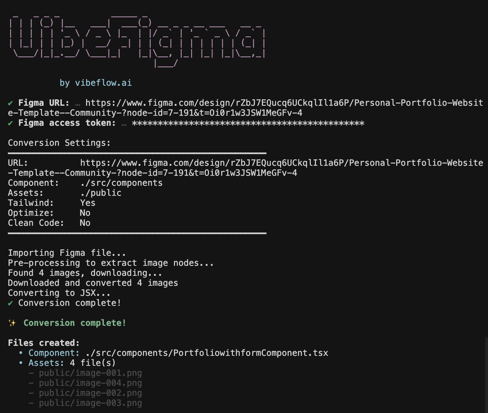

# VibeFigma - Figma to React Converter

[](https://www.npmjs.com/package/vibefigma)
[](https://github.com/vibeflowing-inc/vibefigma)
[](LICENSE)

Transform your Figma designs into production-ready React components with Tailwind CSS, shadcn/ui, and your custom design system.

<div align="center">
  
</div>

## Features

- **React Component Generation** - Convert Figma frames to React/TypeScript components
- **Tailwind CSS Support** - Automatic Tailwind class generation with your custom config
- **AI Code Cleanup** - Optional AI-powered code cleanup for production-ready output
- **Component Deduplication** - Detect and extract reusable components automatically
- **Component Set Collapse** - Turn a multi-variant component set into one parametrized component instead of sending every variant to the AI ([docs](docs/component-sets.md))
- **Token-safe AI** - A built-in token guard never sends an over-limit payload to Gemini, so conversions degrade gracefully instead of crashing on the free tier
- **UI Framework Mapping** - Map designs to shadcn/ui, MUI, or Chakra components
- **Custom Design System Support** - Use your existing Tailwind config for perfect consistency

## Quick Start

### Interactive Mode (Easiest)

```bash
npx vibefigma --interactive
```

### Direct Command

```bash
npx vibefigma "https://www.figma.com/design/..." --token YOUR_TOKEN
```

## New Features

### 1. Component Deduplication

Automatically detect and extract duplicate components:

```bash
npx vibefigma [url] --dedupe-components
```

Features:
- Tree-based similarity detection
- Automatic component extraction with typed props
- Reduces code duplication

### 2. UI Framework Mapping

Map your Figma designs to popular UI frameworks:

```bash
npx vibefigma [url] --framework shadcn --tailwind-config ./tailwind.config.js
```

Supported frameworks:
- `shadcn` - shadcn/ui components (recommended)
- `mui` - Material-UI components
- `chakra` - Chakra UI components
- `none` - Plain HTML/CSS (default)

**Custom Design System Integration:**

When you provide your `tailwind.config.js`, the AI mapper will:
- Replace hex colors with your custom color classes (e.g., `bg-brand-primary`, `text-text-primary`)
- Use your custom spacing scale (e.g., `spacing-300`, `gap-400`)
- Apply your custom border radius (`rounded-100`, `rounded-200`)
- Use your custom font sizes (`body-sm`, `heading-lg`)

### 3. AI Code Cleanup

Clean up generated code with AI:

```bash
npx vibefigma [url] --clean
```

Requires `GOOGLE_GENERATIVE_AI_API_KEY` environment variable.

### 4. Component Set Collapse (many variants → one component)

A Figma component set can hold dozens of variants (e.g. a Button with 6 families × 5 sizes × 6 states ≈ 180 variants). Converting it naively renders ~180 near-identical subtrees and sends them all to Gemini — which blows past the token limit and crashes the run, especially on a free API key.

`--collapse-variants` detects the component set, converts only a small **color-covering sample** of variants (the color-bearing axes at a fixed size, e.g. Variant × State), collects the variant axes, and asks the AI to emit **one parametrized component** (`<Button variant size state>`) instead. Colors are read from the real samples (not guessed) and a deterministic post-pass snaps any LLM color drift back to the design's exact palette.

```bash
npx vibefigma [url] --clean --collapse-variants --spec ./button.md
```

- `--collapse-variants` — enable the collapse (requires `--clean` for the parametrized output).
- `--variant-samples <n>` — max variant samples sent to the AI (default 48). More = better color fidelity; `1` = single representative variant.
- `--spec <path>` — optional design-system spec (markdown) used to anchor the prop contract, naming, and token usage.

See [docs/component-sets.md](docs/component-sets.md) for details, including the token guard that prevents over-limit crashes even without this flag.

## Complete Workflow

The conversion pipeline runs in this order:

1. **Collapse Variants** (optional) - Reduce a component set to one representative variant + its variant axes
2. **Figma → JSX** - Convert design to React JSX
3. **Optimize** (optional) - Run Babel transformations
4. **AI Clean** (optional) - Clean up code quality (and parametrize, when collapsing variants)
5. **Component Deduplication** (optional) - Extract reusable components
6. **Framework Mapping** (optional) - Map to shadcn/ui with your design system
7. **Color Mapping** - Apply your custom Tailwind colors

Every AI step (4–7) is wrapped by a **token guard**: if the estimated payload exceeds `MAX_AI_INPUT_TOKENS`, that step is skipped (with a warning) and the un-transformed code is kept — the run never crashes on an over-limit Gemini request.

### Full Example

```bash
export GOOGLE_GENERATIVE_AI_API_KEY=your_key

npx vibefigma \
  "https://www.figma.com/design/..." \
  --token $FIGMA_TOKEN \
  --framework shadcn \
  --tailwind-config ./tailwind.config.js \
  --dedupe-components \
  --clean \
  --force
```

## Command Options

```
Usage: vibefigma [options] [url]

Arguments:
  url                           Figma file/node URL

Options:
  -V, --version                 Output the version number
  -t, --token <token>           Figma access token (overrides FIGMA_TOKEN env var)
  -u, --url <url>               Figma file/node URL
  -c, --component <path>        Component output path (default: ./src/components/[ComponentName].tsx)
  -a, --assets <dir>            Assets directory (default: ./public)
  --no-tailwind                 Disable Tailwind CSS (enabled by default)
  --optimize                    Optimize components using Babel transformations
  --clean                       Use AI code cleaner (requires GOOGLE_GENERATIVE_AI_API_KEY)
  --no-classes                  Don't generate CSS classes
  --no-absolute                 Don't use absolute positioning
  --no-responsive               Disable responsive design
  --no-fonts                    Don't include fonts
  --dedupe-components           Detect and deduplicate similar components
  --collapse-variants           Collapse a component set to one parametrized component
  --variant-samples <n>         Max variant samples sent to the AI when collapsing (default 48)
  --spec <path>                 Design-system spec (markdown) to anchor the prop contract when collapsing
  --framework <type>            Target UI framework (shadcn|mui|chakra|none)
  --tailwind-config <path>      Path to your tailwind.config.js for design system mapping
  --interactive                 Force interactive mode
  -f, --force                   Overwrite existing files without confirmation
  -h, --help                    Display help for command
```

## Environment Variables

```bash
# Figma API
FIGMA_TOKEN=your_figma_access_token
FIGMA_ACCESS_TOKEN=your_figma_access_token

# Google AI (for code cleanup and framework mapping)
GOOGLE_GENERATIVE_AI_API_KEY=your_google_ai_key

# Token guard: max estimated input tokens per Gemini call.
# Default (60000) is tuned for a FREE Gemini API key — a run may issue up to 3
# Gemini calls within one minute, sharing the free-tier per-minute token budget
# (~250k TPM for Flash). Raise this on a paid tier.
MAX_AI_INPUT_TOKENS=60000
```

## Output Examples

### Basic Conversion

```bash
npx vibefigma "https://www.figma.com/design/..."
```

**Before (Figma):**
- Nested frames
- Auto-layout constraints
- Vector networks

**After (React):**
```tsx
const ComponentName = () => {
  return (
    <div className="flex flex-col gap-4 p-6">
      <h1 className="text-2xl font-bold">Title</h1>
      <p className="text-gray-600">Description</p>
    </div>
  );
};
```

### With Framework Mapping

```bash
npx vibefigma "https://www.figma.com/design/..." \
  --framework shadcn \
  --tailwind-config ./tailwind.config.js \
  --clean
```

**After (shadcn/ui with design system):**
```tsx
import { Button } from "@/components/ui/button"
import { Card, CardContent, CardHeader, CardTitle } from "@/components/ui/card"

const ComponentName = () => {
  return (
    <Card className="p-600 border-border-primary">
      <CardHeader>
        <CardTitle className="text-text-primary">Title</CardTitle>
      </CardHeader>
      <CardContent className="text-text-secondary">
        Description
      </CardContent>
    </Card>
  );
};
```

## Component Deduplication

The `--dedupe-components` flag detects similar subtrees and extracts them as reusable components.

**Before:**
```tsx
// Same pattern repeated 5 times
<div className="flex items-center gap-3">
  <CheckIcon />
  <p>Feature text</p>
</div>
```

**After:**
```tsx
const FeatureItem = ({ text }: { text: string }) => (
  <div className="flex items-center gap-3">
    <CheckIcon />
    <p>{text}</p>
  </div>
);

// Used 5 times with different props
<FeatureItem text="Feature 1" />
<FeatureItem text="Feature 2" />
// ...
```

## Development

```bash
# Install dependencies
bun install

# Run CLI in development mode
bun run dev:cli

# Build CLI
bun run build:cli

# Test CLI
bun run cli -- --help
```

## Acknowledgments

This project includes code derived from [css-to-tailwindcss](https://github.com/Jackardios/css-to-tailwindcss) by Salakhutdinov Salavat, licensed under the MIT License.

## License

This project is licensed under the GNU Affero General Public License v3.0 (AGPL-3.0). See the [LICENSE](LICENSE) file for the full license text.

See the [NOTICE](NOTICE) file for details about third-party code used in this project.

## Contributing

Contributions are welcome! Please feel free to submit a Pull Request.
